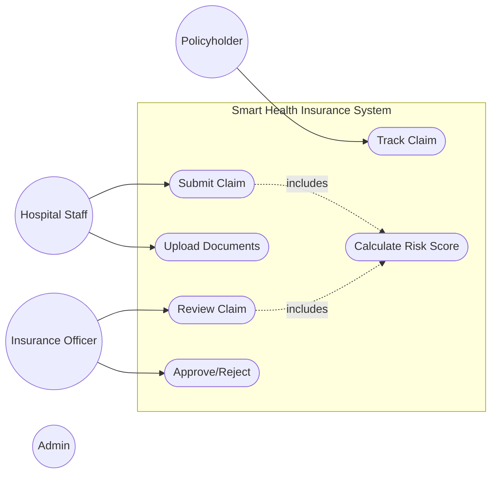
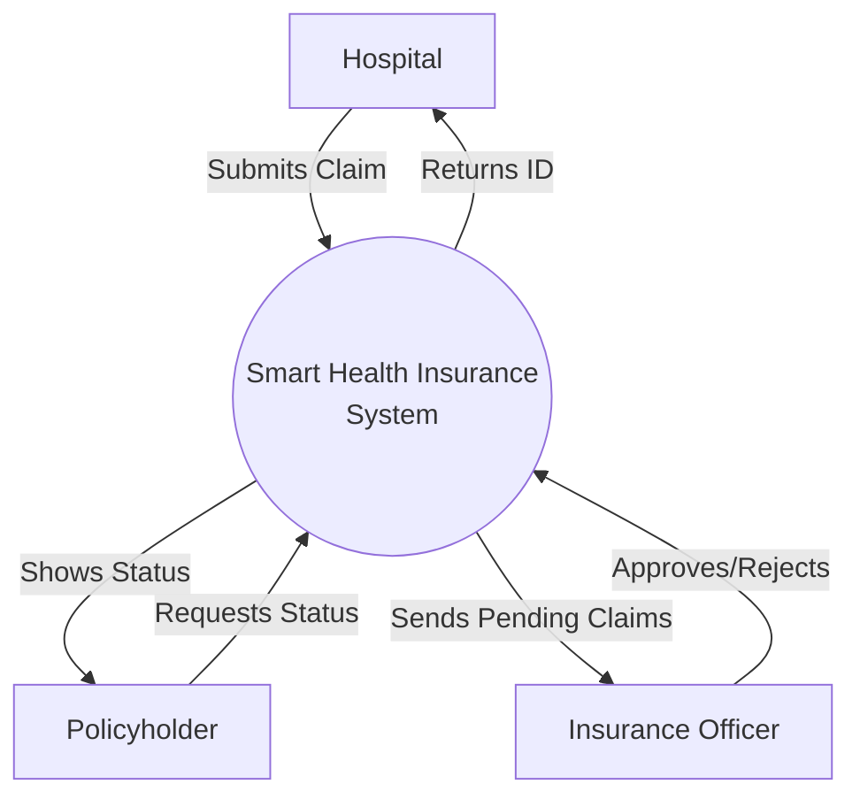
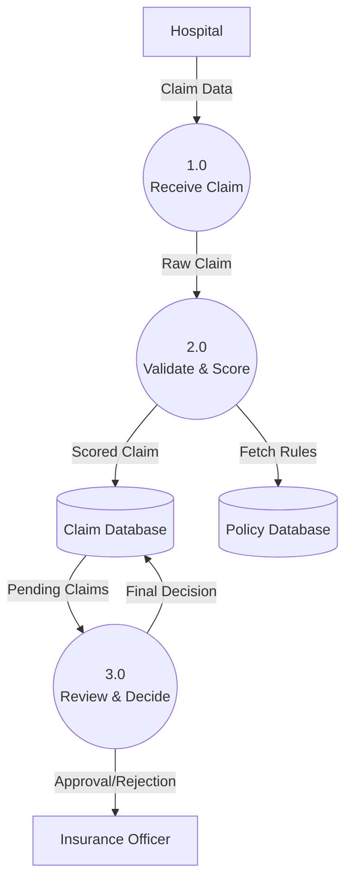
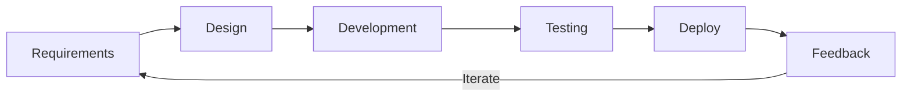

# Project Title: Smart Health Insurance Claim Processing and Fraud Detection System

**Submitted To:** Miss Shumaila Qamar  
**Submitted By:** Ahmer Khan #71725  
**Date:** 15/06/2026  

---

## 1. Abstract
The "Smart Health Insurance Claim Processing and Fraud Detection System" is a project we built to improve how health insurance claims are handled. Right now, insurance companies struggle with slow manual verifications and the constant risk of fake or fraudulent claims. This manual process causes a lot of delays and customer dissatisfaction. 

Our proposed software automates this process. It lets hospitals submit claims online, automatically checks if the policy covers it, and calculates a "fraud risk score" for every claim. By doing this, we can speed up the process, reduce fraud, and make it easier for patients and officers to track everything.

---

## 2. Letter of Acknowledgment
**To,**  
**Miss Shumaila Qamar,**  

We want to thank you for your guidance and support during the development of this Complex Computing Problem (CCP) project. Your Software Engineering classes really gave us the direction we needed to design and document this system. This project wouldn't have been possible without your help and feedback. Thank you for pushing us to think practically.

Sincerely,  
**Ahmer Khan**  

---

## 3. Problem Statement
A health insurance provider gets thousands of medical claims from different hospitals every month. The current process is almost entirely manual. Insurance officers have to manually check patient details, hospital eligibility, and policy coverage for every claim. 

Because of this, the system has huge delays and administrative burdens. It's also really hard to spot fraudulent claims quickly. There is no central digital system connecting hospitals, policyholders, and the insurance company. This results in financial losses from fraud and angry customers who have to wait weeks for approvals. Our project aims to build a centralized software to fix this.

---

## 4. Scope of the System
**Included:**
* A web portal for hospitals to submit claims online.
* Automated logic to validate policies.
* A basic rule-based fraud risk scoring system.
* A dashboard for insurance officers to approve/reject claims.
* Separate dashboards for Hospitals, Policyholders, and Officers.

**Excluded:**
* Integration with international hospitals.
* Advanced Machine Learning or AI models (we are just using rule-based scoring for now).
* Direct bank payment integration (not handling real money transfers).

---

## 5. Features
* **Online Claim Submission:** Hospitals can easily upload claim details and PDFs.
* **Automated Validation:** Instant checking if the patient's policy covers the treatment.
* **Fraud Risk Scoring:** Flags suspicious claims automatically.
* **Role-Based Dashboards:** Secure interfaces for different users.
* **Claim Tracking:** Patients can log in and see their claim status.
* **Notifications:** Updates when a claim is approved or rejected.

---

## 6. Requirements

### Functional Requirements
1. The system should allow hospitals to submit insurance claims.
2. Hospitals must be able to upload medical documents.
3. The system will verify if the claim is covered under the policy.
4. The system will assign a fraud risk score (Low, Medium, High).
5. Insurance Officers can approve, reject, or flag a claim.
6. Policyholders get a portal to view their claim status.

### Non-Functional Requirements
1. **Performance:** The system should calculate risk scores quickly (within a few seconds).
2. **Security:** Role-Based Access Control (RBAC) so hospitals can't access officer screens.
3. **Availability:** System needs to be up 24/7.
4. **Usability:** The UI should be simple enough that anyone can use it without training.

---

## 7. Meta Data and Use Case Diagram

**Meta Data:**  
The system stores:
* **Policyholder Data:** Name, Policy ID, Expiry Date.
* **Hospital Data:** Hospital ID, Name.
* **Claim Data:** Claim ID, Treatment, Amount Billed.
* **Officer Data:** Officer ID, Approval History.
* **Risk Data:** Risk Score, Triggered Rules.

### Use Case Diagram

---

## 8. Data Flow Diagrams (DFDs)

### Context Diagram (Level 0)

### Level 1 DFD

---

## 9. Suggested Process Model

**Chosen Model:** Agile Model

**Justification:**  
We chose Agile because requirements can change as we build it. Instead of doing everything at once (like Waterfall), Agile lets us build the app in small pieces (sprints). We can build the login and dashboard first, test it, and then add the fraud detection logic later. It makes the development process much easier to manage for our team.

---

## 10. Prototype Screenshots
*(Insert the screenshots of our React app here)*
- Screenshot 1: Login Screen
- Screenshot 2: Hospital Dashboard
- Screenshot 3: Claim Submission Form
- Screenshot 4: Officer Review Screen
- Screenshot 5: Policyholder Tracking Screen

---

## 11. CCP Attributes Mapped

| Attributes of Complex Problem Solving | Justification |
| :--- | :--- |
| **WP1 (Conflicting Requirements)** | Hospitals want fast payouts but insurance companies want strict fraud checks. We balanced this by automating the checks for speed while keeping the rules strict. |
| **WP2 (Depth of Analysis)** | We had to analyze how medical claims work in real life. Finding out how to detect duplicate claims or out-of-coverage things took a lot of mapping and understanding. |
| **WP3 (Depth of Knowledge)** | Building this required good knowledge of React, software design, and understanding business rules for insurance. |
| **WP4 (Familiarity of issues)** | NA |
| **WP5 (Extent of applicable codes)** | NA |
| **WP6 (Extent of stakeholder involvement)** | NA |
| **WP7 (Consequences)** | Approving a fake claim costs money, but rejecting a real one hurts the patient. We had to make sure high-risk claims are reviewed manually by a human to avoid bad consequences. |
| **WP8 (Interdependence)** | Everything is connected. The fraud module relies completely on the claim data. If one part breaks, the whole flow stops, so we had to plan the DFDs carefully. |

---

## 12. References
1. Sommerville, I. (2015). *Software Engineering* (10th ed.). Pearson.
2. Miss Shumaila Qamar's Software Engineering Lecture Slides.
