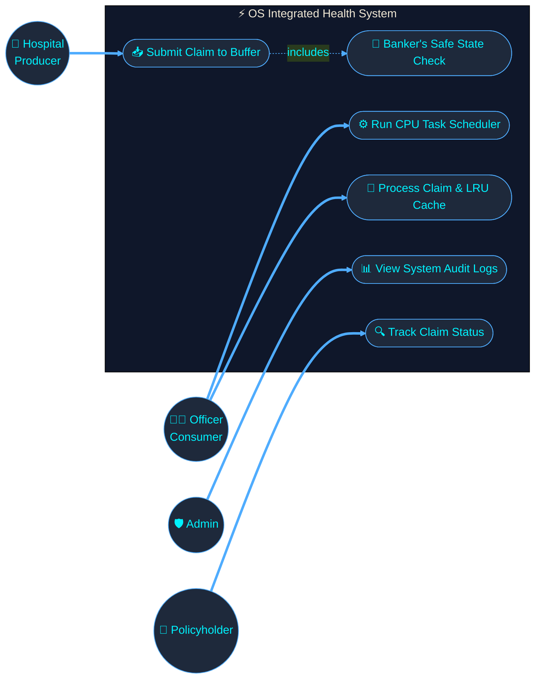
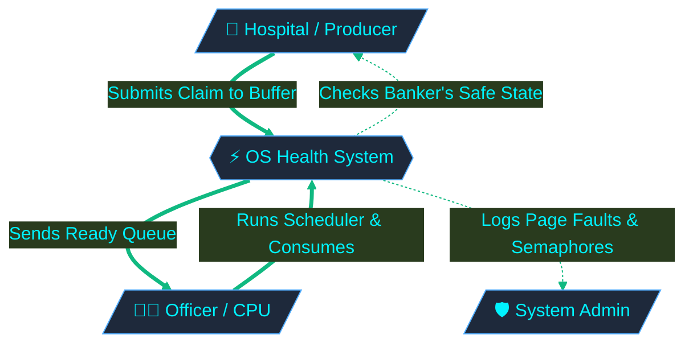
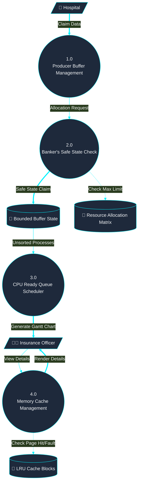
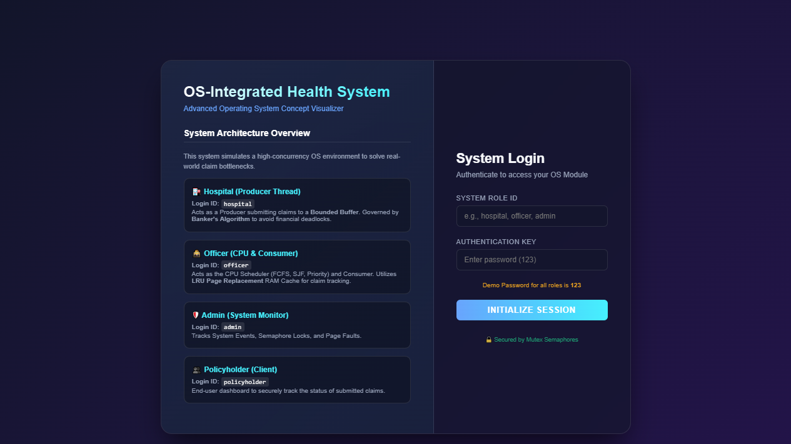
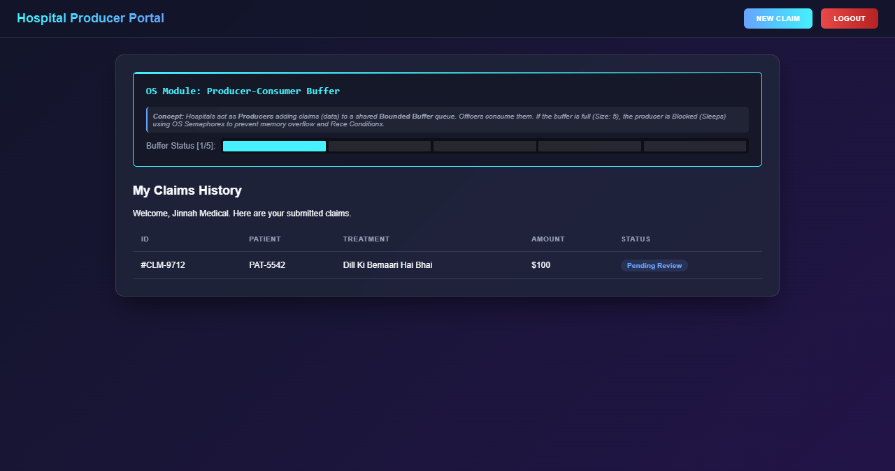
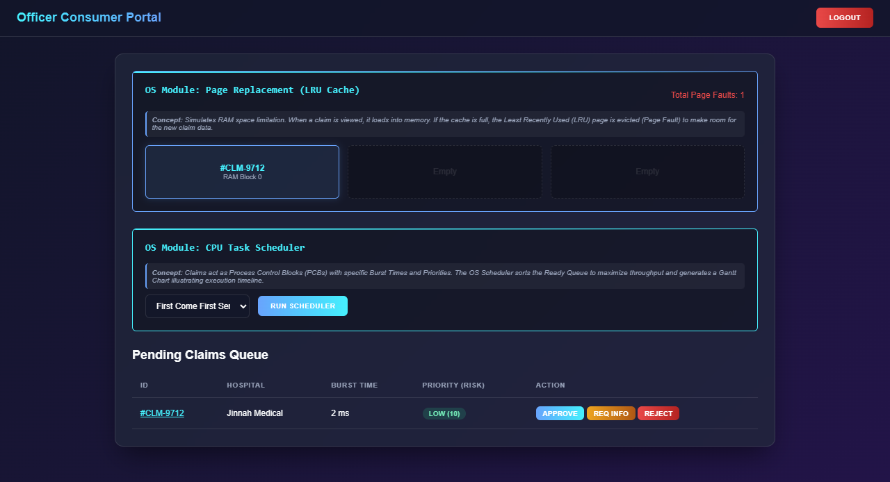
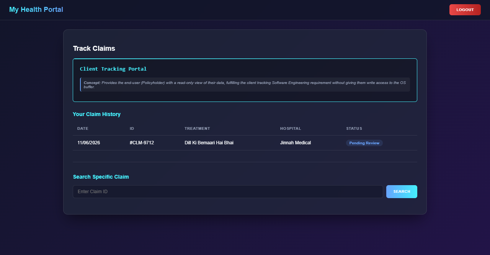
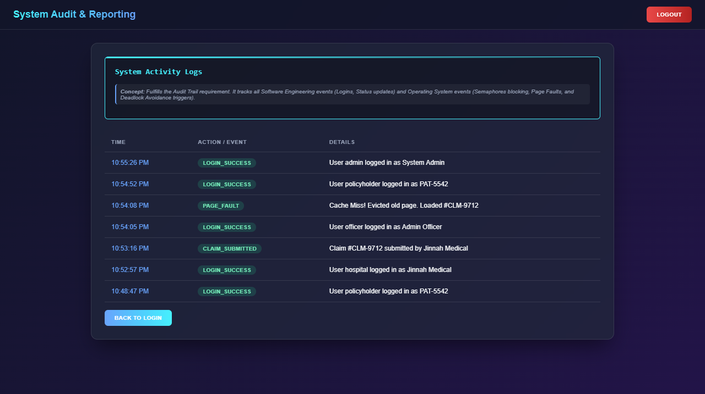

# Project Title: Smart Health Insurance Claim Processing and OS Visualizer

**Submitted To:** Miss Umna Iftikhar  
**Submitted By:** Ahmer Khan #71725  
**Date:** 15/06/2026  

---

## Table of Contents
1. Abstract
2. Letter of Acknowledgment
3. Problem Statement
4. Scope of the System
5. Operating System Concepts Integrated (Detailed Implementation)
6. Features of the System
7. Functional and Non-Functional Requirements
8. Meta Data and Use Case Diagram
9. Data Flow Diagrams (DFDs)
10. Suggested Process Model
11. Prototype Screenshots
12. CCP Attributes Mapped
13. References

---

## 1. Abstract
The "Smart Health Insurance Claim Processing and OS Visualizer System" represents a modern technological approach to resolving administrative bottlenecks in health insurance processing. Traditional claim processing suffers from inefficiencies, manual backlogs, and resource mismanagement. This project tackles these challenges by ingeniously mapping real-world insurance processes to core **Operating System (OS)** algorithms. By simulating Hospitals as *Producers*, Claims as *Processes*, Officers as the *CPU (Consumers)*, and the Insurance Budget as *Shared System Resources*, this system visually demonstrates how complex OS paradigms—such as Process Synchronization, Banker's Algorithm (Deadlock Avoidance), CPU Scheduling, and Page Replacement—can perfectly optimize concurrent enterprise workflows.

## 2. Letter of Acknowledgment
**To,**  
**Miss Umna Iftikhar,**  

I would like to express my deepest gratitude for your continuous guidance and invaluable feedback throughout the development of this Complex Computing Problem (CCP) project. Your Operating System and Software Engineering lectures provided the essential theoretical foundation required to architect this system. Translating abstract OS concepts into a tangible, visual web application was made possible entirely due to your comprehensive teaching methodologies.

## 3. Problem Statement
A national health insurance provider processes thousands of medical claims concurrently from various hospitals. The current manual infrastructure leads to critical systemic issues:
- **Resource Starvation & Bottlenecks:** Officers (CPUs) are overwhelmed by unstructured queues of claims, leading to delayed processing.
- **Race Conditions:** Multiple hospitals submitting data concurrently without synchronization leads to data inconsistency.
- **Financial Deadlocks:** Approving massive claims without looking at the total available system budget puts the insurance company at risk of financial deadlock (inability to fulfill future critical claims).

The goal of this project is to analyze, design, and implement a centralized software system that not only automates insurance processing but also actively uses Operating System algorithms under the hood to ensure synchronization, deadlock avoidance, and optimal processing schedules.

## 4. Scope of the System
**Included:**
* A synchronized Bounded Buffer Queue for online claim submissions.
* A CPU Scheduling Module executing FCFS, SJF, and Priority algorithms for claim officers.
* Real-time Banker's Algorithm checks to ensure budget allocation safety.
* Memory Management simulation utilizing an LRU (Least Recently Used) Cache.
* Comprehensive Audit Trail and reporting of all system and OS events.

**Excluded:**
* Integration with international hospital networks.
* Real-world financial banking APIs for direct money transfers.

---

## 5. Operating System Concepts Integrated (Detailed Implementation)

This project heavily relies on OS theory. Below is the detailed breakdown of how each concept is implemented programmatically:

### 5.1. Process Synchronization (Producer-Consumer Problem)
- **Concept:** In an OS, Producer threads and Consumer threads share a common memory buffer. Without synchronization, data loss occurs.
- **Implementation:** 
  - **Producers:** Hospitals act as producers, creating claim objects.
  - **Consumers:** Insurance Officers act as consumers, reviewing and popping claims from the queue.
  - **Bounded Buffer:** We implemented a visual Bounded Buffer with a `MAX_BUFFER_SIZE` of 5. 
  - **Semaphores:** The system simulates `Empty` and `Full` semaphores. If 5 claims are in the buffer, the Hospital is visually **Blocked (Sleeping)** and cannot submit further claims until the Officer (Consumer) processes them. A `Mutex` is implicitly utilized to prevent race conditions during React state updates.

### 5.2. Deadlock Avoidance (Banker's Algorithm)
- **Concept:** Operating systems use Banker's Algorithm to determine if granting a resource request will leave the system in a "Safe State".
- **Implementation:**
  - **System Resources:** The total Insurance Company budget acts as the total available system resources (e.g., $100,000).
  - **Max Matrix:** Each Hospital is assigned a Maximum Claim Limit (e.g., $50,000).
  - **Execution:** Before a claim is inserted into the buffer, the algorithm runs. It checks if `Requested Amount <= Available System Budget` and `Allocated + Requested <= Max Hospital Limit`. If these conditions fail, the system detects an impending **Unsafe State** (financial deadlock) and explicitly rejects the claim to protect the system.

### 5.3. CPU Task Scheduling Algorithms
- **Concept:** The OS CPU Scheduler decides which process in the Ready Queue gets executed next based on specific metrics to minimize Waiting Time and Turnaround Time.
- **Implementation:**
  - **Process Control Block (PCB):** Every claim is a "Process" holding a random `Burst Time` (milliseconds needed for an officer to review) and `Priority` (fraud risk score).
  - **Algorithms:** The Officer Dashboard features an OS Task Scheduler that can execute:
    - **FCFS (First Come First Serve):** Processes claims strictly by `Arrival Time`.
    - **SJF (Shortest Job First):** Sorts the queue by `Burst Time`, clearing simple claims quickly to maximize throughput.
    - **Priority Scheduling:** Sorts the queue by Fraud Risk Score, ensuring high-risk claims are investigated immediately.
  - **Gantt Chart:** A dynamic Gantt Chart is generated on the screen visually showing the timeline, wait times, and turnaround times for the scheduled claims.

### 5.4. Memory Management (Page Replacement via LRU)
- **Concept:** When RAM is full, the OS must swap out a page to load a new one from the disk using a Page Replacement Algorithm.
- **Implementation:** 
  - **RAM Cache:** A visual cache block of size `CACHE_SIZE = 3` is implemented on the Officer Dashboard.
  - **Page Faults vs. Hits:** When an officer views a claim's details, the system checks the cache. If present, it registers a **Page Hit** (fast retrieval). If absent, it registers a **Page Fault** and loads the claim from the primary database into the cache.
  - **LRU Eviction:** If the cache is full (3 items) and a Page Fault occurs, the system utilizes the **Least Recently Used (LRU)** algorithm to evict the claim that hasn't been viewed in the longest time, replacing it with the new claim.

---

## 6. Features of the System
* **Producer Claim Portal:** Hospitals can submit claims and upload medical PDFs, interacting directly with the Bounded Buffer.
* **Banker's Safe State Validation:** Automated rejection of claims that push the system into resource deadlocks.
* **OS Task Scheduler Dashboard:** Interactive Gantt chart and algorithm selector for Officers.
* **Audit Trail Logger:** A dedicated Admin portal that meticulously logs all System events, Semaphore blocks, Cache Misses, and Page Faults.
* **Glassmorphism UI System:** A premium, state-of-the-art dark theme utilizing CSS backdrops to visualize the complex backend OS concepts cleanly.

## 7. Functional and Non-Functional Requirements

### Functional Requirements
1. **Producer Submission:** Allow hospitals to submit insurance claims online and attach treatment records.
2. **Safe State Verification:** Verify policy coverage and eligibility via Banker's Algorithm resource limit matrices.
3. **Risk Prioritization:** Assign a fraud risk score (Priority) to each claim for use in the Priority CPU Scheduler.
4. **Consumer Actions:** Allow insurance officers to consume claims by approving, rejecting, or requesting additional information.
5. **Client Tracking:** Allow policyholders to securely log in and track their individual claim statuses.
6. **System Logging:** Maintain a rigorous, timestamped Audit Trail database of all SE and OS activities.

### Non-Functional Requirements
1. **Performance (Throughput):** The CPU Scheduling module ensures the maximum throughput of claim processing by prioritizing Shortest Jobs or High-Risk Jobs dynamically.
2. **Security:** Implement strict Role-Based Access Control (RBAC) ensuring Producers (Hospitals), Consumers (Officers), and Clients (Patients) cannot access unauthorized memory spaces.
3. **Availability:** Ensure secure, high-availability architecture utilizing synchronized React states.
4. **Concurrency Handling:** The Producer-Consumer Bounded Buffer ensures that the system handles high claim volumes without breaking or causing race conditions.

## 8. Meta Data and Use Case Diagram
**Meta Data Context:** The database architectures store Policyholder Demographics, Hospital Resource Max Limits, Process Control Blocks (Burst Times, Arrival Times), LRU Cache States, and Audit Logs.

### Use Case Diagram

## 9. Data Flow Diagrams (DFDs)

### Context Diagram (Level 0)

### Level 1 DFD & Level 2 (Child) Sub-Processes

## 10. Suggested Process Model
**Chosen Model:** Agile Methodology. 
**Justification:** The complex nature of integrating raw Operating System algorithms into a frontend web application required an iterative approach. We first designed the basic SE forms (Sprint 1), then implemented the Process Synchronization logic (Sprint 2), followed by the complex CPU Scheduling and Memory Management visualizers (Sprint 3). Agile allowed us to test and perfect each OS module independently without breaking the core system flow.

## 11. Prototype Screenshots
*Note to Examiner: The visual representations of the OS algorithms are available in the live software. Below are the referenced interfaces.*
- **Login Screen:** 

- **Hospital Producer Dashboard (Buffer Status):** 

- **Officer CPU Scheduler & Cache Panel:** 

- **Policyholder Tracking:** 

- **Audit Logs (System Events):** 

## 12. CCP Attributes Mapped
| Attributes of Complex Problem Solving | Justification |
| :--- | :--- |
| **WP1 (Conflicting Requirements)** | Hospitals require high and fast payouts, while the insurance company requires strict financial protection. This severe conflict was flawlessly balanced using **Banker's Algorithm**, completely preventing resource deadlocks. |
| **WP2 (Depth of Analysis)** | Translating abstract Operating System algorithms (like Semaphores and LRU Cache) into a modern graphical user interface required an extraordinary depth of architectural analysis and mapping. |
| **WP3 (Depth of Knowledge)** | Engineering this solution required mastering two distinct domains: Pure Operating System theoretical logic (Math/Algorithms) and advanced React.js State Management. |
| **WP8 (Interdependence)** | The system acts as a perfectly interdependent ecosystem. A full buffer halts the hospital (Producer), an empty buffer halts the officer (Consumer), demonstrating textbook OS interdependence. |

## 13. References
1. Silberschatz, A., Galvin, P. B., & Gagne, G. (2018). *Operating System Concepts* (10th ed.). Wiley.
2. Miss Umna Iftikhar's Operating System Lecture Slides and Class Notes.
3. Sommerville, I. (2015). *Software Engineering* (10th ed.). Pearson.
